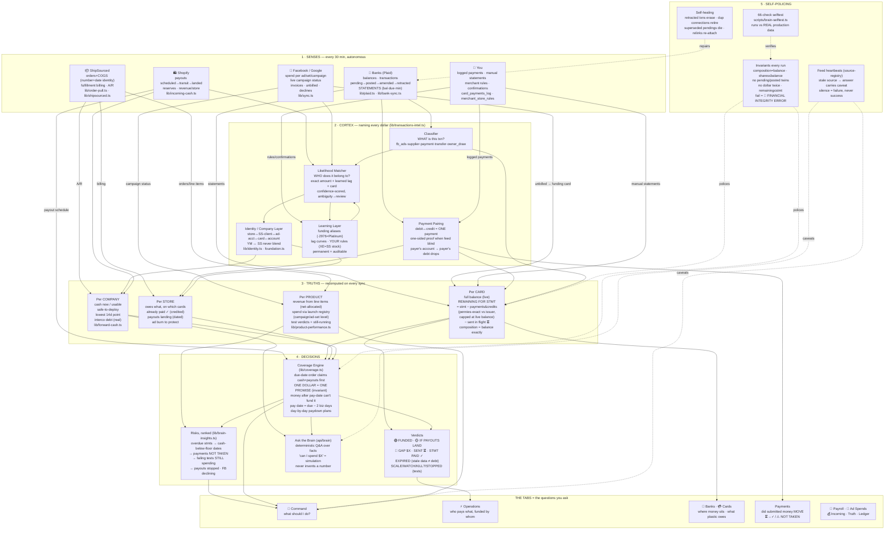

# 🧠 THE BRAIN — Full System Mind Map

*How `/dashboard/transactions` thinks, what it does, and how every piece connects.*
*State as of 2026-08-31. Files referenced are the single source of truth for each fact.*

---

## The one-glance map (every arrow = a real data dependency)



---

## The same map, branch by branch (with the WHY of each connection)

```
🧠 THE BRAIN
│
├── 1 · SENSES ──────────────── "hear everything" (30-min loop, instrumentation.ts)
│   ├── Banks (Plaid) ─────────┐
│   │   ├─ balances/txns ──────┼─→ feeds CLASSIFIER (every txn gets named)
│   │   ├─ lifecycle: pending→posted→amended→RETRACTED
│   │   │      └─→ feeds SELF-HEALING (bounced payment = phantom erased)
│   │   └─ statements (bal·due·min) ─→ feeds PER-CARD TRUTH directly
│   ├── Shopify payouts/reserves ─→ feeds COVERAGE (dated inflows that fund bills)
│   │                             └→ feeds COMPANY CASH (incoming pipeline)
│   ├── FB/Google spend ─→ feeds MATCHER (invoice↔charge) + PRODUCT ENGINE
│   │   └─ live campaign status ─→ feeds TEST VERDICTS ("still running?")
│   ├── ShipSourced orders/billing ─→ feeds PRODUCT revenue + STORE debts + interco
│   └── YOU ─ logged payments → PAIRING · rules/confirmations → LEARNING
│                                └── every answer you give becomes permanent
│
├── 2 · CORTEX ──────────────── "name every dollar" (transactions-intel.ts)
│   ├── WHAT  (classifier) ──connects──→ WHO (matcher needs the class's lag curve)
│   ├── WHO   (matcher) ←─feeds/fed by─→ LEARNING (aliases, lag, your rules)
│   │      └── evidence chain: exact amount + settlement lag + card match
│   │          → confidence · single-candidate+card = 85% floor · ambiguity = review
│   ├── PAIRING ──connects──→ PER-CARD (payments walk remaining down)
│   │            └─connects──→ PER-STORE (payer's OWN account credits payer's debt)
│   └── IDENTITY/COMPANY ──connects──→ everything (YM↔SS never blend;
│           the same layer that routes SS-usage-on-YM-cards into interco debt)
│
├── 3 · TRUTHS ──────────────── "know the state" (recomputed, never stored stale)
│   ├── PER CARD: live balance ≠ statement ≠ remaining ≠ in-flight — four numbers,
│   │        four meanings, each connected to the exact events behind it
│   │        └── remaining drives COVERAGE; composition drives OWED-BY;
│   │            in-flight (your logged payments) drives SENT ⏳
│   ├── PER STORE: owes/paid/landing/burn ── connects to COVERAGE as the
│   │        funding pools ("Purebite's payout funds Purebite's share first")
│   ├── PER COMPANY: usable cash → safe-to-deploy → lowest-14d-point
│   │        └── connects to ASK-THE-BRAIN ("can I spend $50k" simulates this)
│   └── PER PRODUCT: launch registry (campaign/ad-set exact) + net-allocated
│            line-item revenue → test verdicts → connects to RISKS when burning
│
├── 4 · DECISIONS ───────────── "act on it"
│   ├── COVERAGE: obligations in due order eat cash+dated payouts — one dollar,
│   │        one promise (tested invariant) → emits the PAYMENT CALENDAR
│   │        └── connects to VERDICTS (funded/gap) and CMD (what to do today)
│   ├── VERDICTS: every card/test state is a word with evidence, never a color alone
│   ├── RISKS: ranked by money × urgency — each with WHY + ACTION
│   │        └── only live problems (paused burns don't nag — alarm fatigue kills)
│   └── ASK THE BRAIN: deterministic answers from these truths; no LLM in money path
│
├── 5 · SELF-POLICING ───────── "prove it" (what makes trusting it rational)
│   ├── INVARIANTS: math that must hold, checked every run, loud on failure
│   ├── HEARTBEATS: every feed's freshness → degraded feeds degrade confidence visibly
│   ├── SELF-HEALING: retractions, twins, dup connections, relink re-attachment
│   └── 66-CHECK SELFTEST vs production data — including the permanent
│        ShipSourced-settlement regression ($3,984.91+$3,044.84=$7,029.75→$0)
│
└── TABS ────────────────────── each = one question, answered from the truths above
    🧠 Command → ⚡ Operations → 🏦/💳 Accounts → 👥 Payroll → 📣 Ad Spends
    → 💰 Incoming → Payments (⏳→✓/⚠) → Card Intelligence → Source of Truth → Ledger
```

---

## The five laws the connections obey

1. **One pipeline** — every surface reads the same spine; no view computes privately, no view knows less than the Brain.
2. **One dollar, one promise** — cash/payout allocation is exclusive and tested.
3. **Evidence or silence** — attribution needs proof; no proof = untracked (visible), never a guess.
4. **Stale is stated** — a number backed by a dead feed says so; expired manual data is EXPIRED, not debt.
5. **Your answers become rules** — anything only you can know is asked once, then learned forever.
```
